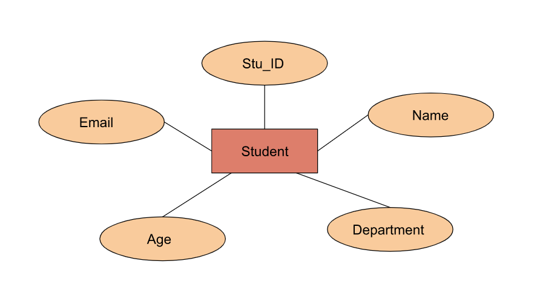
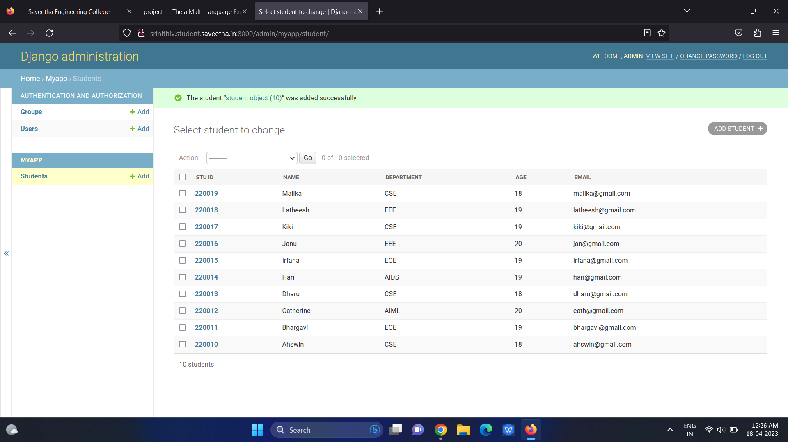

# Ex02 Django ORM Web Application

## AIM
To develop a Django application to store and retrieve data from a student database using Object Relational Mapping(ORM).

## Entity Relationship Diagram



## DESIGN STEPS

### STEP 1:
Clone the repository from github.

### STEP 2:
Create an admin interface for django.

### STEP 3:
Create an app and edit settings.py

### STEP 4:
Make migrations and migrate the changes.

### STEP 5:
create admin user and write python code for admin and models.

### STEP 6:
Make all the migrations to 'myapp'.

### STEP 7:
Create an student database with 10 fields using runserver command.

## PROGRAM

```
admin.py

from django.contrib import admin
from.models import student,studentAdmin
admin.site.register(student,studentAdmin)

models.py

from django.db import models
from django.contrib import admin
class student(models.Model):
    Stu_ID=models.CharField(max_length=20)
    Name=models.CharField(max_length=100)
    Department=models.CharField(max_length=100)
    Age=models.IntegerField()
    Email=models.EmailField()

class studentAdmin(admin.ModelAdmin):
    list_display=('Stu_ID','Name','Department','Age','Email')
```

## OUTPUT



## RESULT

The program for creating an student database using ORM is executed sucessfully.

